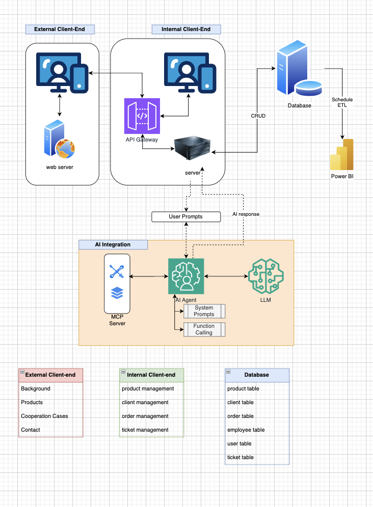

# Smart CRM Suite (Enterprise-Grade Business Management Platform)

A comprehensive enterprise-level Customer Relationship Management system with AI integration, featuring complete business operation management from customer interaction to internal business processes.

## 🎯 System Architecture Overview



### Three-Tier Architecture Design

```
┌─────────────────────────────────────────────────────────────────────────────┐
│                           PRESENTATION LAYER                                │
├─────────────────────────────┬───────────────────────────────────────────────┤
│     External Client-End     │           Internal Client-End                │
│                             │                                               │
│  🌐 Customer Interface      │  🏢 Enterprise Management Dashboard           │
│  ├── Background/Home        │  ├── Product Management                       │
│  ├── Products Catalog       │  ├── Client Management                        │
│  ├── Cooperation Cases      │  ├── Order Management                         │
│  └── Contact/Support        │  └── Ticket Management                        │
│                             │                                               │
│  Port: 5173 (Vite)          │  Port: 3000 (React)                          │
└─────────────────────────────┴───────────────────────────────────────────────┘
                                            │
┌─────────────────────────────────────────────────────────────────────────────┐
│                           BUSINESS LOGIC LAYER                              │
│                                                                             │
│                        🔄 API Gateway (Smart Weave Core)                   │
│                        ├── Authentication & Authorization                   │
│                        ├── Rate Limiting & Security                         │
│                        ├── Service Orchestration                            │
│                        ├── AI Integration Hub                               │
│                        └── Business Process Coordination                    │
│                                                                             │
│                              Port: 8000 (Express)                          │
└─────────────────────────────────────────────────────────────────────────────┘
                                            │
┌─────────────────────────────────────────────────────────────────────────────┐
│                           MICROSERVICES LAYER                               │
│                                                                             │
│  ┌─────────────────┐  ┌─────────────────┐  ┌─────────────────┐             │
│  │  User Service   │  │ Ticket Service  │  │  Chat Service   │             │
│  │  Port: 8001     │  │  Port: 8002     │  │  Port: 8003     │             │
│  │  - User CRUD    │  │  - Workflow     │  │  - AI Agent     │             │
│  │  - Auth         │  │  - Priority     │  │  - NLP          │             │
│  │  - Profiles     │  │  - Assignment   │  │  - Context      │             │
│  └─────────────────┘  └─────────────────┘  └─────────────────┘             │
│                                                                             │
│                    ┌─────────────────────────────────┐                     │
│                    │      Notification Service       │                     │
│                    │         Port: 8004              │                     │
│                    │    - Email/SMS Alerts           │                     │
│                    │    - Push Notifications         │                     │
│                    │    - Workflow Triggers          │                     │
│                    └─────────────────────────────────┘                     │
└─────────────────────────────────────────────────────────────────────────────┘
                                            │
┌─────────────────────────────────────────────────────────────────────────────┐
│                            DATA LAYER                                       │
│                                                                             │
│  📊 Database Management                    🤖 AI Integration                │
│  ├── Product Table                        ├── MCP Server                   │
│  ├── Client Table                         ├── AI Agent System              │
│  ├── Order Table                          ├── Function Calling             │
│  ├── Employee Table                       ├── LLM Integration              │
│  ├── User Table                           └── User Prompts                 │
│  └── Ticket Table                                                          │
│                                                                             │
│  🔄 Schedule ETL → 📈 Power BI (Analytics & Reporting)                     │
└─────────────────────────────────────────────────────────────────────────────┘
```

## 🏢 Enterprise Business Modules

### External Client-End (Customer-Facing)
- **Background/Home**: Company introduction and value proposition
- **Products**: Product catalog with detailed specifications
- **Cooperation Cases**: Success stories and case studies
- **Contact**: AI-powered customer service and ticket submission

### Internal Client-End (Enterprise Management Dashboard)
- **Product Management**: 
  - Product lifecycle management
  - Inventory tracking
  - Pricing strategies
  - Product performance analytics

- **Client Management (CRM)**:
  - Customer profiles and segmentation
  - Interaction history tracking
  - Customer satisfaction metrics
  - Relationship management workflows

- **Order Management**:
  - Order processing workflows
  - Payment tracking
  - Fulfillment management
  - Revenue analytics

- **Ticket Management**:
  - Support ticket routing
  - Priority assignment
  - SLA tracking
  - Resolution analytics

## 🗄️ Database Schema Design

### Core Business Tables
```sql
-- Product Management
CREATE TABLE products (
    id SERIAL PRIMARY KEY,
    name VARCHAR(255) NOT NULL,
    description TEXT,
    price DECIMAL(10,2),
    category_id INTEGER,
    status VARCHAR(50),
    created_at TIMESTAMP,
    updated_at TIMESTAMP
);

-- Client/Customer Management
CREATE TABLE clients (
    id SERIAL PRIMARY KEY,
    company_name VARCHAR(255),
    contact_person VARCHAR(255),
    email VARCHAR(255),
    phone VARCHAR(50),
    industry VARCHAR(100),
    status VARCHAR(50),
    created_at TIMESTAMP,
    updated_at TIMESTAMP
);

-- Order Management
CREATE TABLE orders (
    id SERIAL PRIMARY KEY,
    client_id INTEGER REFERENCES clients(id),
    total_amount DECIMAL(12,2),
    status VARCHAR(50),
    order_date TIMESTAMP,
    delivery_date TIMESTAMP,
    created_at TIMESTAMP,
    updated_at TIMESTAMP
);

-- Employee Management
CREATE TABLE employees (
    id SERIAL PRIMARY KEY,
    name VARCHAR(255),
    email VARCHAR(255),
    role VARCHAR(100),
    department VARCHAR(100),
    hire_date DATE,
    status VARCHAR(50),
    created_at TIMESTAMP,
    updated_at TIMESTAMP
);

-- User Authentication
CREATE TABLE users (
    id SERIAL PRIMARY KEY,
    username VARCHAR(100) UNIQUE,
    email VARCHAR(255) UNIQUE,
    password_hash VARCHAR(255),
    role VARCHAR(50),
    last_login TIMESTAMP,
    created_at TIMESTAMP,
    updated_at TIMESTAMP
);

-- Ticket Management
CREATE TABLE tickets (
    id SERIAL PRIMARY KEY,
    client_id INTEGER REFERENCES clients(id),
    assigned_to INTEGER REFERENCES employees(id),
    title VARCHAR(255),
    description TEXT,
    priority VARCHAR(50),
    status VARCHAR(50),
    created_at TIMESTAMP,
    resolved_at TIMESTAMP,
    updated_at TIMESTAMP
);
```

## 🤖 AI Integration Components

### MCP (Model Context Protocol) Server
- **Function Calling**: Dynamic API interaction
- **Context Management**: Conversation state persistence  
- **System Prompts**: Business-specific AI behavior
- **LLM Integration**: Large language model connectivity

### AI-Powered Features
1. **Intelligent Customer Service**
   - Natural language query processing
   - Automated ticket classification
   - Context-aware responses
   - Escalation decision making

2. **Business Intelligence**
   - Predictive analytics for sales
   - Customer behavior analysis
   - Automated reporting generation
   - Performance trend identification

## 📊 Analytics & Reporting (Power BI Integration)

### Scheduled ETL Pipeline
- **Data Extraction**: From operational databases
- **Data Transformation**: Business metrics calculation
- **Data Loading**: Into analytics warehouse
- **Report Generation**: Automated dashboard updates

### Key Business Metrics
- Customer acquisition and retention rates
- Product performance and profitability
- Order fulfillment efficiency
- Support ticket resolution times
- Employee productivity metrics

## 🚀 Getting Started

### Prerequisites
- Node.js 18+
- PostgreSQL 14+
- Redis (for caching)
- Power BI (for analytics)

### Quick Start
```bash
# Clone repository
git clone <repository-url>
cd smart-crm-suite

# Install all dependencies
npm install

# Setup environment variables
cp .env.example .env

# Start all services in development mode
npm run dev:all
```

### Service URLs
- **Customer Portal**: http://localhost:5173
- **Admin Dashboard**: http://localhost:3000  
- **API Gateway**: http://localhost:8000
- **Microservices**: http://localhost:8001-8004

This enterprise-grade system provides a complete business management solution with modern architecture, AI integration, and comprehensive analytics capabilities.